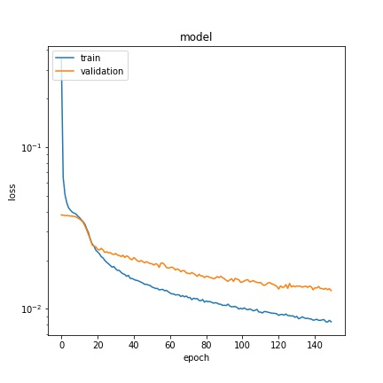

# Behaviorial Cloning Project

[](http://www.udacity.com/drive)

#### Data collection and Exploration
The cameras in the simulator capture images in size of 160 x 320 x 3. I drive the car clocwise and counter-clockwise to combat the bias towards the left turns. The following plots show the distributions of steering angles of training and testing dataset.


There are three cameras on the vehicle, I use images taken by all of them, but correcting the steering agnle by 0.2 for image taken by left cameras and -0.2 for right cameras. I also randomly flip the images as shown in the following


#### Model Architecture
First, I crop the top part of images that have information not relevant to driving. Then I use three convoluted layers with 64, 96, and 128 filters respectively, and each of which is followed by a maximum pooling with keep probability of 0.8. The last conv2D layer is flattened and followed by three fully connected layers of size 128, 64 and 1 with keep prbability of 0.7, 0.7 and 1 respectively. Dropout is used to avoid overfitting.

|               | input size    | kernel size | filters | keep probability |
| ------------  |:-------------:|:-----------:|:-------:|:----------------:|
|    conv2D     | 160 x 320 x 3 |    5 x 5    |    64   |      0.8         |
|    conv2D     | 5 x 5 x 128   |    3 x 3    |    96   |      0.8         |
|    conv2D     | 3 x 3 x 128   |    3 x 3    |   128   |      0.8         |
|  full connect | flatten       |             |         |      1           |
|  full connect | 128           |             |         |      0.7         |
|  full connect | 64            |             |         |      0.7         |
|  full connect | 1             |             |         |      1           |


#### Model Training
The model is trained to predict the steering angle, loss function is MSE (Mean Squared Error) = sum (f_i - y_i)^2 / N, where N is number of samples and f_i is the estimation of y_i. I minimize MSE using AdamOptimizer with learning rate of 5e-5 in 150 epochs. The loss of training and validation in 150 epochs. The car isdriven autonomously around the track by executing
```
python drive.py model.hdf5
```

 Loss function             | Auto Driving
:-------------------------:|:-------------------------:
 | 

